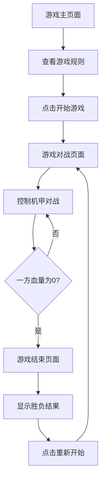

## 1. Product Overview
像素风机甲对战小游戏是一款基于网页的双人对战游戏，玩家可以控制机甲进行移动、攻击和防御。
- 主要目的是提供一个简单但有趣的对战体验，让玩家可以快速上手并享受游戏乐趣。
- 目标用户是喜欢复古像素风格游戏的玩家，特别是那些喜欢简单操作但有策略性的游戏。

## 2. Core Features

### 2.1 User Roles
| Role | Registration Method | Core Permissions |
|------|---------------------|------------------|
| Player | 无需注册 | 控制机甲进行对战 |

### 2.2 Feature Module
1. **游戏主页面**：游戏标题、开始按钮、游戏规则
2. **游戏对战页面**：机甲对战场景、控制按钮、血量显示
3. **游戏结束页面**：胜负结果、重新开始按钮

### 2.3 Page Details
| Page Name | Module Name | Feature description |
|-----------|-------------|---------------------|
| 游戏主页面 | 游戏标题 | 显示游戏名称和像素风格的机甲图片 |
| 游戏主页面 | 开始按钮 | 点击进入游戏对战页面 |
| 游戏主页面 | 游戏规则 | 显示游戏操作说明和胜负条件 |
| 游戏对战页面 | 机甲对战场景 | 显示两个机甲角色和战斗背景 |
| 游戏对战页面 | 控制按钮 | 提供移动、攻击、防御等操作按钮 |
| 游戏对战页面 | 血量显示 | 显示两个机甲的当前血量 |
| 游戏结束页面 | 胜负结果 | 显示哪方获胜的结果 |
| 游戏结束页面 | 重新开始按钮 | 点击重新开始游戏 |

## 3. Core Process
玩家打开游戏 → 查看游戏规则 → 点击开始游戏 → 进入对战页面 → 控制机甲进行对战 → 一方血量为0后游戏结束 → 显示胜负结果 → 选择重新开始游戏

## 4. User Interface Design
### 4.1 Design Style
- 主色调：深蓝色 (#1a237e) 和红色 (#d32f2f)
- 次要色：黄色 (#ffeb3b) 和绿色 (#4caf50)
- 按钮风格：3D像素风格，有明显的边框和阴影
- 字体：像素风格字体，如 Press Start 2P
- 布局风格：居中布局，简洁明了
- 图标风格：像素风格，简洁易识别

### 4.2 Page Design Overview
| Page Name | Module Name | UI Elements |
|-----------|-------------|-------------|
| 游戏主页面 | 游戏标题 | 大号像素字体，居中显示，有闪烁动画 |
| 游戏主页面 | 开始按钮 | 3D像素风格按钮，悬停时有放大效果 |
| 游戏主页面 | 游戏规则 | 小号像素字体，清晰列出操作说明 |
| 游戏对战页面 | 机甲对战场景 | 像素风格背景，两个机甲角色左右对立 |
| 游戏对战页面 | 控制按钮 | 方向键控制移动，攻击和防御按钮 |
| 游戏对战页面 | 血量显示 | 条形血槽，红色表示当前血量，绿色表示最大血量 |
| 游戏结束页面 | 胜负结果 | 大号像素字体，显示获胜方 |
| 游戏结束页面 | 重新开始按钮 | 3D像素风格按钮，点击后重新开始游戏 |

### 4.3 Responsiveness
- 桌面优先设计，支持键盘控制
- 移动设备适配，支持触摸屏幕操作
- 响应式布局，在不同屏幕尺寸下保持游戏元素的合理比例

### 4.4 3D Scene Guidance
- 本游戏为2D像素风格，不包含3D场景