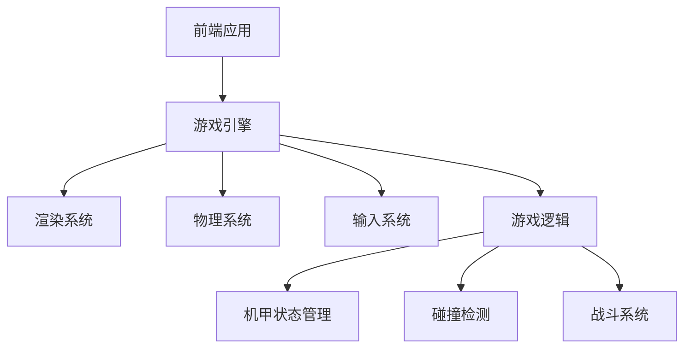
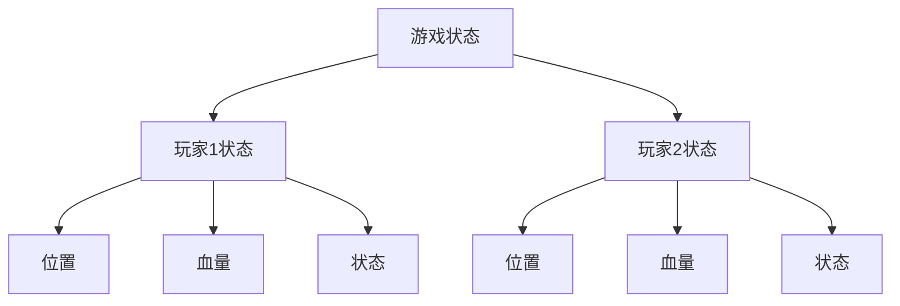

## 1. Architecture Design

## 2. Technology Description
- Frontend: React@18 + tailwindcss@3 + vite
- Initialization Tool: vite-init
- Backend: None
- Database: None
- Game Engine: Custom Canvas-based game engine

## 3. Route Definitions
| Route | Purpose |
|-------|---------|
| / | 游戏主页面 |
| /game | 游戏对战页面 |
| /game-over | 游戏结束页面 |

## 4. API Definitions
- 无后端API，所有游戏逻辑在前端执行

## 5. Server Architecture Diagram
- 无后端服务

## 6. Data Model
### 6.1 Data Model Definition

### 6.2 Data Definition Language
- 无数据库，游戏状态存储在内存中

## 7. Implementation Details
### 7.1 游戏引擎核心模块
1. **渲染系统**：使用Canvas API绘制游戏场景和角色
2. **物理系统**：处理角色移动和碰撞检测
3. **输入系统**：处理键盘和触摸输入
4. **游戏逻辑**：处理游戏规则和战斗系统

### 7.2 机甲角色设计
1. **属性**：血量、移动速度、攻击力、防御力
2. **状态**：正常、攻击、防御、受伤
3. **动画**： idle、移动、攻击、防御、受伤、死亡

### 7.3 战斗系统
1. **攻击**：造成伤害，有冷却时间
2. **防御**：减少受到的伤害，有持续时间和冷却时间
3. **伤害计算**：基础伤害 - 防御值 = 实际伤害

### 7.4 游戏流程
1. **初始化**：加载游戏资源，设置初始状态
2. **主循环**：更新游戏状态，处理输入，渲染场景
3. **碰撞检测**：检测角色之间的碰撞
4. **战斗逻辑**：处理攻击和防御
5. **游戏结束**：当一方血量为0时，结束游戏

### 7.5 性能优化
1. **Canvas渲染**：使用requestAnimationFrame进行高效渲染
2. **状态管理**：使用React的useState和useEffect进行状态管理
3. **资源加载**：预加载游戏资源，减少游戏中的加载时间

### 7.6 响应式设计
1. **桌面端**：使用键盘控制，显示完整游戏界面
2. **移动端**：使用触摸按钮控制，适配屏幕尺寸

### 7.7 技术栈选择理由
1. **React**：组件化开发，便于管理游戏状态和UI
2. **Tailwind CSS**：快速构建响应式UI，便于实现像素风格
3. **Canvas API**：高性能渲染，适合游戏开发
4. **Vite**：快速的开发服务器和构建工具