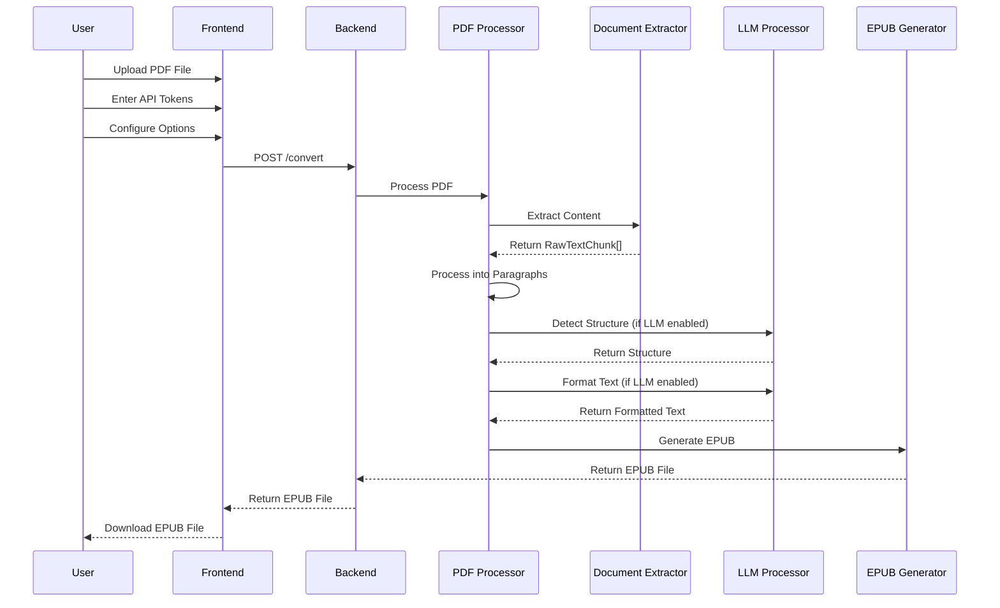

# PDF to EPUB Converter Web Application - Architecture Design Document

## 1. Overall Architecture

### 1.1 System Overview

The PDF to EPUB Converter Web Application is a full-stack web application that converts PDF files to EPUB format using PyMuPDF for text extraction and optional LLM integration for enhanced formatting. The application follows a modular architecture with clear separation between frontend and backend components.

### 1.2 Architecture Diagram

```mermaid
flowchart TD
    subgraph Frontend
        A[User Interface] --> B[HTML Templates]
        B --> C[Static Files]
    end

    subgraph Backend
        D[FastAPI Application] --> E[API Endpoints]
        E --> F[PDF Processor]
        F --> G[EPUB Generator]
        F --> H[LLM Processor]
        F --> I[Document Extractor]
    end

    subgraph External Services
        J[PaddleOCR API]
        K[OpenAI API]
    end

    A -->|File Upload| E
    E -->|Process PDF| F
    F -->|Extract Content| I
    I -->|RawTextChunk[]| F
    F -->|Generate EPUB| G
    F -->|Format Text| H
    H -->|API Call| K
    F -->|Optional API Call| J
    E -->|Return EPUB| A
```

### 1.3 Component Relationships

- **Frontend**: Handles user interaction, file uploads, and display of results
- **Backend**: Processes PDF files, generates EPUB files, and integrates with external APIs
- **Document Extractor**: Provides a unified interface for PDF text extraction, generating a globally consistent RawTextChunk[] array
- **External Services**: Provide OCR and LLM capabilities for enhanced processing

## 2. Frontend Architecture

### 2.1 Components

- **HTML Templates**: Jinja2 templates for rendering the user interface
- **Static Files**: CSS styles and other static resources
- **User Interface**: Form for file upload, API token input, and conversion options

### 2.2 File Structure

```
webapp/app/
├── static/
│   └── style.css      # CSS styles for the application
└── templates/
    └── index.html     # Main page template
```

### 2.3 User Interface Flow

1. User accesses the application
2. User uploads a PDF file
3. User enters API tokens (PaddleOCR and optionally OpenAI)
4. User configures conversion options (title, author, TOC generation)
5. User submits the form
6. Application processes the PDF and generates EPUB
7. User downloads the generated EPUB file

## 3. Backend Architecture

### 3.1 Components

- **FastAPI Application**: Main application framework
- **API Endpoints**: RESTful endpoints for file upload and processing
- **PDF Processor**: Handles PDF extraction and processing
- **Document Extractor**: Provides a unified interface for PDF text extraction, generating a globally consistent RawTextChunk[] array
- **EPUB Generator**: Generates EPUB files from processed content
- **LLM Processor**: Integrates with OpenAI API for enhanced text formatting
- **Configuration**: Manages environment variables and application settings

### 3.2 API Endpoints

- **GET /**: Renders the main page
- **POST /convert**: Processes uploaded PDF files and returns EPUB files

### 3.3 File Structure

```
webapp/app/
├── main.py            # FastAPI application and endpoints
├── config.py          # Configuration settings
└── utils/
    ├── pdf_processor.py     # PDF processing logic
    ├── document_extractor.py # Unified document extraction interface
    ├── epub_generator.py    # EPUB generation logic
    └── llm_processor.py     # LLM integration logic
```

### 3.4 Configuration

The application uses environment variables for configuration, including:
- `PADDLE_API_TOKEN`: API token for PaddleOCR API
- `LLM_API_KEY`: API key for OpenAI API (optional)
- `LLM_MODEL`: LLM model to use (default: gpt-4o)

## 4. PDF Processing Workflow

### 4.1 Process Overview

1. **PDF Extraction**: Extract text and images from PDF using Document Extractor
2. **Text Processing**: Process extracted RawTextChunk[] array into paragraphs
3. **Structure Detection**: Detect book structure (title, author, chapters)
4. **Text Formatting**: Format text for better readability
5. **EPUB Generation**: Generate EPUB file from processed content

### 4.2 Detailed Workflow

```mermaid
flowchart TD
    A[PDF Upload] --> B[Document Extractor]
    B --> C[Generate RawTextChunk[]]
    C --> D[Process into Paragraphs]
    D --> E{LLM Enabled?}
    E -->|Yes| F[LLM Structure Detection]
    E -->|No| G[Heuristic Structure Detection]
    F --> H[LLM Text Formatting]
    G --> I[Basic Text Formatting]
    H --> J[Generate EPUB]
    I --> J
    J --> K[Return EPUB File]
```

### 4.3 Key Functions

- `DocumentExtractor.extract()`: Extracts text from PDF and generates RawTextChunk[] array
- `DocumentExtractor.get_paragraphs_from_chunks()`: Processes RawTextChunk[] array into paragraphs
- `extract_pdf_content()`: Extracts text and images from PDF using DocumentExtractor
- `detect_book_structure()`: Detects book structure using heuristics
- `process_pdf()`: Main processing function
- `generate_epub()`: Generates EPUB file

## 5. LLM Integration Architecture

### 5.1 Overview

The LLM integration provides enhanced text formatting and structure detection capabilities. It uses the OpenAI API to process text and improve the quality of the generated EPUB.

### 5.2 Components

- **LLMProcessor**: Handles communication with OpenAI API
- **Structure Detection**: Uses LLM to detect book structure
- **Text Formatting**: Uses LLM to format text for better readability
- **Fallback Mechanism**: Falls back to heuristic methods if LLM is not available

### 5.3 Workflow

1. **API Key Validation**: Check if LLM API key is provided
2. **Structure Detection**: Use LLM to analyze text and detect structure
3. **Text Formatting**: Use LLM to format text for better readability
4. **Fallback**: Use heuristic methods if LLM API call fails

### 5.4 Key Functions

- `detect_book_structure()`: Uses LLM to detect book structure
- `format_paragraphs()`: Uses LLM to format text
- `generate_toc()`: Uses LLM to generate table of contents

## 6. Data Flow

### 6.1 Overall Data Flow



### 6.2 Data Transformation

1. **PDF to RawTextChunk[]**: Extract text from PDF into RawTextChunk[] array using Document Extractor
2. **RawTextChunk[] to Paragraphs**: Process RawTextChunk[] array into paragraphs
3. **Text to Structured Content**: Detect book structure and format text
4. **Structured Content to EPUB**: Generate EPUB file from structured content

## 7. Design Decisions and Best Practices

### 7.1 Key Design Decisions

- **Modular Architecture**: Clear separation of concerns between components
- **Unified Document Extractor**: Single interface for PDF text extraction, ensuring consistent RawTextChunk[] array generation
- **Optional LLM Integration**: LLM is optional, with fallback to heuristic methods
- **Temporary File Management**: Automatic cleanup of temporary files
- **Error Handling**: Comprehensive error handling with user feedback
- **Configuration Management**: Environment variables for configuration

### 7.2 Best Practices Followed

- **Code Organization**: Clear directory structure and modular code
- **Error Handling**: Graceful error handling and user feedback
- **Security**: Secure handling of API tokens
- **Performance**: Efficient processing of PDF files
- **Maintainability**: Well-documented code and architecture

### 7.3 Rationale

- **FastAPI**: Chosen for its performance, documentation, and ease of use
- **PyMuPDF**: Chosen for its efficient PDF extraction capabilities
- **EbookLib**: Chosen for its comprehensive EPUB generation features
- **LLM Integration**: Added to improve text formatting and structure detection

## 8. Integration Points

### 8.1 External APIs

- **PaddleOCR API**: Optional for OCR capabilities
- **OpenAI API**: Optional for enhanced text formatting and structure detection

### 8.2 Internal Integration

- **Frontend-Backend**: RESTful API for file upload and processing
- **PDF Processor-EPUB Generator**: Data transfer for EPUB generation
- **PDF Processor-LLM Processor**: Data transfer for enhanced processing

## 9. Future Enhancements

### 9.1 Potential Improvements

- **Support for more LLM providers**
- **Enhanced OCR capabilities**
- **User authentication and session management**
- **Batch processing of multiple PDF files**
- **Custom EPUB styling options**
- **Progress tracking for large files**

### 9.2 Scaling Considerations

- **Horizontal Scaling**: Deploy multiple instances for increased capacity
- **Caching**: Cache frequently processed content
- **Asynchronous Processing**: Process large files asynchronously
- **Load Balancing**: Distribute requests across multiple instances

## 10. Molecular Architecture

### 10.1 Frontend Molecular Components

#### 10.1.1 User Interface Components
- **File Upload Component**: Handles PDF file selection and validation
- **API Token Input Component**: Securely collects and validates API tokens
- **Conversion Options Component**: Provides UI for configuring conversion parameters
- **Progress Indicator Component**: Shows processing status and progress
- **Download Component**: Manages EPUB file download

#### 10.1.2 Frontend Services
- **Form Validation Service**: Validates user input before submission
- **File Size Checker**: Ensures uploaded files meet size requirements
- **Local Storage Service**: Persists user preferences and settings

### 10.2 Backend Molecular Components

#### 10.2.1 API Layer
- **Request Parser**: Parses and validates incoming requests
- **File Handler**: Manages file uploads and temporary storage
- **Response Formatter**: Formats API responses consistently

#### 10.2.2 PDF Processing Layer
- **Chunk Generator**: Creates RawTextChunk objects from PDF content
- **Text Analyzer**: Analyzes text structure and formatting
- **Image Extractor**: Extracts images from PDF pages

#### 10.2.3 LLM Processing Layer
- **Prompt Builder**: Constructs optimized prompts for LLM calls
- **Response Parser**: Parses and processes LLM responses
- **Error Handler**: Manages LLM API errors and retries

#### 10.2.4 EPUB Generation Layer
- **Content Organizer**: Organizes content into EPUB structure
- **Metadata Builder**: Creates EPUB metadata
- **File Assembler**: Assembles final EPUB file

### 10.3 Data Models

#### 10.3.1 Core Data Structures
- **RawTextChunk**: Represents a chunk of text with page and line information
- **Paragraph**: Represents a formatted paragraph
- **Section**: Represents a section or chapter in the book
- **BookStructure**: Represents the overall structure of the book
- **ConversionOptions**: Represents user-specified conversion settings

#### 10.3.2 API Data Models
- **UploadRequest**: Schema for file upload requests
- **ConversionResponse**: Schema for conversion results
- **ErrorResponse**: Schema for error responses

### 10.4 Integration Patterns

#### 10.4.1 Component Interactions
- **Request-Response Pattern**: For API endpoints
- **Pipeline Pattern**: For PDF processing workflow
- **Observer Pattern**: For progress tracking
- **Strategy Pattern**: For different text formatting strategies

#### 10.4.2 Data Flow Patterns
- **Stream Processing**: For large PDF files
- **Batch Processing**: For grouped operations
- **Event-Driven**: For asynchronous processing

### 10.5 Error Handling Architecture

#### 10.5.1 Error Types
- **Validation Errors**: Input validation failures
- **Processing Errors**: PDF processing failures
- **API Errors**: External API failures
- **System Errors**: Internal system failures

#### 10.5.2 Error Handling Strategies
- **Retry Mechanism**: For transient errors
- **Fallback Mechanisms**: For LLM failures
- **Error Logging**: For debugging and monitoring
- **User-Friendly Messages**: For end-user feedback

### 10.6 Security Architecture

#### 10.6.1 Authentication & Authorization
- **API Token Validation**: Validates external API tokens
- **Input Sanitization**: Prevents injection attacks
- **File Type Validation**: Ensures only PDF files are processed

#### 10.6.2 Data Protection
- **Temporary File Encryption**: Secures uploaded files
- **API Token Obfuscation**: Prevents token exposure
- **Secure File Deletion**: Removes temporary files securely

## 11. Conclusion

The PDF to EPUB Converter Web Application follows a modular, well-structured architecture that provides a robust solution for converting PDF files to EPUB format. The optional LLM integration enhances the quality of the generated EPUB by providing better text formatting and structure detection. The architecture is designed to be maintainable, scalable, and extensible, with clear separation of concerns and well-defined integration points.

This architecture documentation serves as a reference for developers, stakeholders, and contributors to understand the system design and make informed decisions about future enhancements and maintenance. The molecular architecture breakdown provides a detailed view of the system's components, interactions, and data flows, enabling more precise implementation and maintenance.
